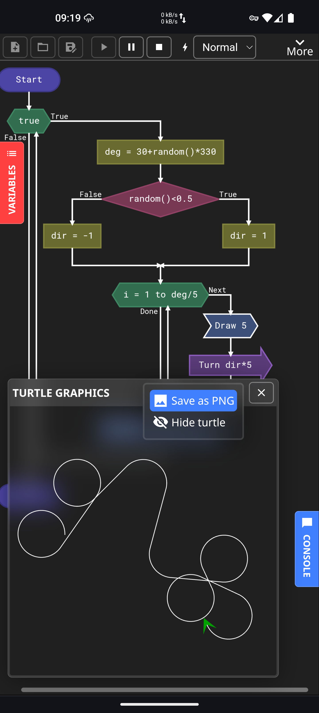

    

__Flogo__ is a free and open source programming language for beginners, designed for learning programming basics within a friendly environment using flow charts.

    <a href="#downloads">Try Flogo</a>

    <a href="#screenshots">Screenshots</a> &bull; <a href="#features">Features</a> &bull; <a href="#downloads">Downloads</a> &bull; <a href="#example-programs">Example programs</a> &bull; <a href="#donate">Donate</a> &bull; <a href="#contributing">Contributing</a> &bull; <a href="#license">License</a>

## Screenshots
| Writing a program                    |
|--------------------------------------|
|          |

| Turtle Graphics                      |
|--------------------------------------|
|          |

| Adding an instruction                |
|--------------------------------------|
|          |

| Running a program                    |
|--------------------------------------|
|          |

| Mobile UI - Editing an instruction   |
|--------------------------------------|
|          |

| Mobile UI - Turtle Graphics          |
|--------------------------------------|
|          |

| Mobile UI - Debugging a crash        |
|--------------------------------------|
|          |

## Features
* Several types of variables: Integer, Real, String, Boolean; variables can also be declared with an initial value
* Strong, statically typed
* Standard C-like syntax for expressions to make it easier to switch to a "real" prorgamming language
* Detection of errors such as overflows, uninitialized variables, etc.
* All standard loop types: Do-While, While and For (basic-style)
* Lazy evaluation of boolean expressions
* Lots of built-in functions (see documentation for a complete list)
* Turtle graphics
* Execution speed control and step-by-step mode to better follow the flow of the program; a turbo mode is also available to run larger programs at maximum speed
* Easy to use UI with Undo/Redo, Cut/Copy/Paste and keyboard shortcuts
* Chat-like Input/Output UI, similar to Flowgorithm
* Several built-in themes
* Very small and optimized, can easily run on an old low-end laptop
* Touchscreen and mobile support
* Export to SVG and PNG
* Built-in documentation
* Runs on all modern browsers, can be installed as a PWA and run completely offline

## Future features
* Arrays (Planned for v1.3, in 2026)
* Functions (Planned for v1.4, in 2026)

## Example programs
__Basics__
* [Sum of 2 integers](https://downloads.fdossena.com/geth.php?r=flogo-demo-01)
* [Seconds to hours, minutes and seconds](https://downloads.fdossena.com/geth.php?r=flogo-demo-02)
* [Dice rolls](https://downloads.fdossena.com/geth.php?r=flogo-demo-03)

__Loops__
* [Average](https://downloads.fdossena.com/geth.php?r=flogo-demo-04)
* [Factorial](https://downloads.fdossena.com/geth.php?r=flogo-demo-05)
* [Speed camera](https://downloads.fdossena.com/geth.php?r=flogo-demo-06)
* [Street light](https://downloads.fdossena.com/geth.php?r=flogo-demo-07)
* [Temperatures (min-max)](https://downloads.fdossena.com/geth.php?r=flogo-demo-08)

__Strings__
* [Palindrome](https://downloads.fdossena.com/geth.php?r=flogo-demo-09)
* [Decimal to binary](https://downloads.fdossena.com/geth.php?r=flogo-demo-10)
* [String trimming](https://downloads.fdossena.com/geth.php?r=flogo-demo-11)
* [Tip calculator](https://downloads.fdossena.com/geth.php?r=flogo-demo-12)
* [Anagram](https://downloads.fdossena.com/geth.php?r=flogo-demo-13)
* [Date and Time](https://downloads.fdossena.com/geth.php?r=flogo-demo-16)

__Mini games__
* [Rock, paper, scissors](https://downloads.fdossena.com/geth.php?r=flogo-demo-14)
* [Quasar (similar to blackjack)](https://downloads.fdossena.com/geth.php?r=flogo-demo-15)

__Turtle Graphics__
* [Hexagon](https://downloads.fdossena.com/geth.php?r=flogo-demo-17)
* [Regular polygon](https://downloads.fdossena.com/geth.php?r=flogo-demo-18)
* [Brick wall](https://downloads.fdossena.com/geth.php?r=flogo-demo-19)

## Downloads
These are the official download links for Flogo, always updated to the latest version.

Don't forget to download some <a href="#example-programs">Example programs</a> to test it!

####  Webapp
[Run Flogo](https://flogo.fdossena.com), it runs directly in your browser and be installed as a PWA on any device.

####  Windows 10/11
[Windows (x64)](https://downloads.fdossena.com/geth.php?r=flogo-win) 👈 This is probably the one you want  
[Windows (ARM)](https://downloads.fdossena.com/geth.php?r=flogo-win-arm)  

####  Linux
[Linux (AppImage for all distros, x64)](https://downloads.fdossena.com/geth.php?r=flogo-linux-appimage) 👈 This is probably the one you want  
[Linux (AppImage for all distros, ARM)](https://downloads.fdossena.com/geth.php?r=flogo-linux-arm-appimage)  
[Linux (AUR package for Arch-based distros)](https://aur.archlinux.org/packages/flogo)  

####  MacOS
[macOS (dmg for Apple Silicon)](https://downloads.fdossena.com/geth.php?r=flogo-mac-arm) 👈 This is probably the one you want  
[macOS (dmg for Intel)](https://downloads.fdossena.com/geth.php?r=flogo-mac-intel)  

## Donate
If you enjoy Flogo, you can support it by leaving a donation using one of the following methods.

If you want to donate using other methods, [get in touch](mailto:info@fdossena.com) and we can discuss it.

## Contributing
If you're a developer, see `BUILDING.md` for instructions on how to build the app.

Pull requests are welcome.

## License
Copyright (C) 2025 Federico Dossena

This program is free software: you can redistribute it and/or modify it under the terms of the GNU Affero General Public License as published by the Free Software Foundation, either version 3 of the License, or (at your option) any later version.

This program is distributed in the hope that it will be useful, but WITHOUT ANY WARRANTY; without even the implied warranty of MERCHANTABILITY or FITNESS FOR A PARTICULAR PURPOSE. See the GNU General Public License for more details.

You should have received a copy of the GNU Affero General Public License along with this program. If not, see <https://www.gnu.org/licenses/>. 

__Credits:__
* [Konva](https://konvajs.org/): Object-oriented JS canvas library (MIT License)
* [jsep](https://ericsmekens.github.io/jsep/): JS expression parser (MIT License)
* [SVGCanvas](https://zenozeng.github.io/svgcanvas/): SVG export library for JS canvas (MIT License)
* [Material Design Icons](https://marella.github.io/material-design-icons): Icons used throughout the application (Apache-2.0 License)
* Fonts distributed under the [SIL Open Font License](https://openfontlicense.org/): Noto Sans, Roboto Mono, Monoton, Caveat, Cinzel
* Some themes use graphics from [SVG Repo](https://www.svgrepo.com/) (CC0)
* The Flogo program file icon is modified from [KDE Breeze Icons](https://github.com/KDE/breeze-icons) (LGPL 2.1)
