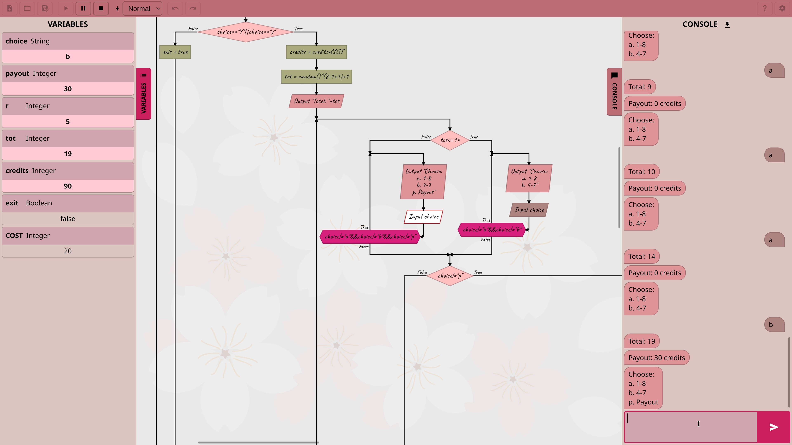

__Flogo__ is a free and open source programming language for beginners, designed to learn programming basics within a friendly environment using flow charts.

[Try Flogo](https://flogo.fdossena.com)

## Features
* Strong, static typing
* Several types of variables: Integer, Real, String, Boolean; variables can also be declared with an initial value
* Standard C-like syntax for expressions to make it easier to switch to a "real" prorgamming language
* Detection of errors such as overflows, uninitialized variables, etc.
* All standard loop types: Do-While, While and For (basic-style)
* Lots of built-in functions (see documentation for a complete list)
* Chat-like interface to interact with the program
* Undo/Redo, Cut/Copy/Paste
* Execution speed control and step-by-step mode to better follow the flow of the program
* Several built-in themes
* Very small and optimized, can easily run on a low-end laptop
* Touchscreen and mobile support
* Export to SVG and PNG
* Built-in documentation
* Runs on all modern browsers, can be installed as a PWA and run completely offline

## Screenshots

## Future features
* Electron version
* Arrays
* Turtle graphics
* Multilingual support

## License
Copyright (C) 2025 Federico Dossena

This program is free software: you can redistribute it and/or modify it under the terms of the GNU Affero General Public License as published by the Free Software Foundation, either version 3 of the License, or (at your option) any later version.

This program is distributed in the hope that it will be useful, but WITHOUT ANY WARRANTY; without even the implied warranty of MERCHANTABILITY or FITNESS FOR A PARTICULAR PURPOSE. See the GNU General Public License for more details.

You should have received a copy of the GNU Affero General Public License along with this program. If not, see <https://www.gnu.org/licenses/>. 

Uses the Noto Sans, Roboto Mono, Caveat and Monoton fonts, distributed under the [SIL Open Font License](https://openfontlicense.org/).
